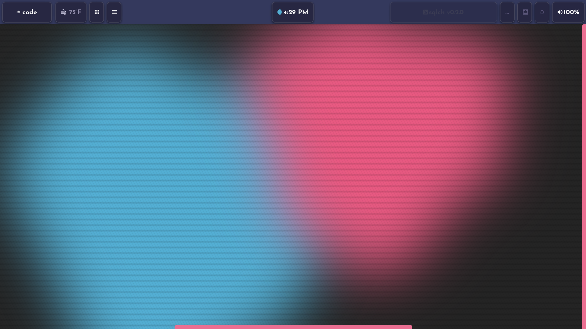
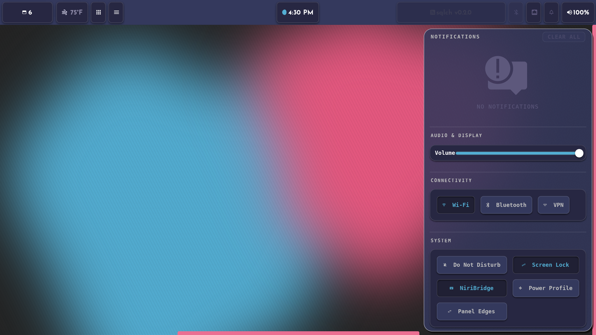
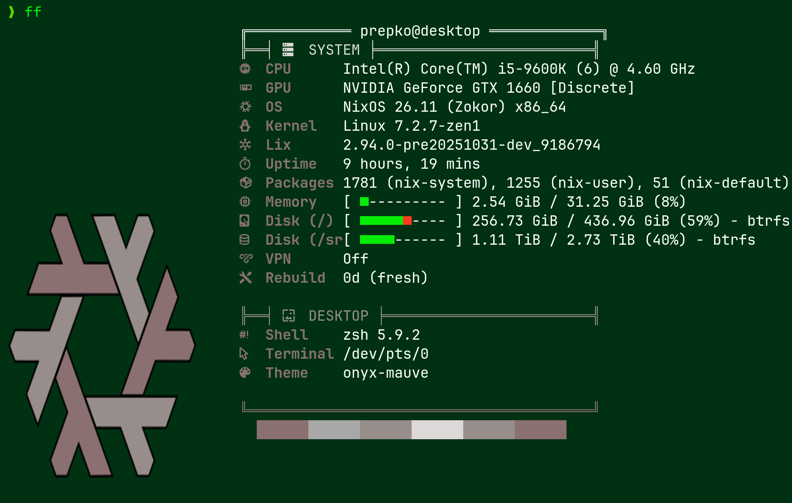
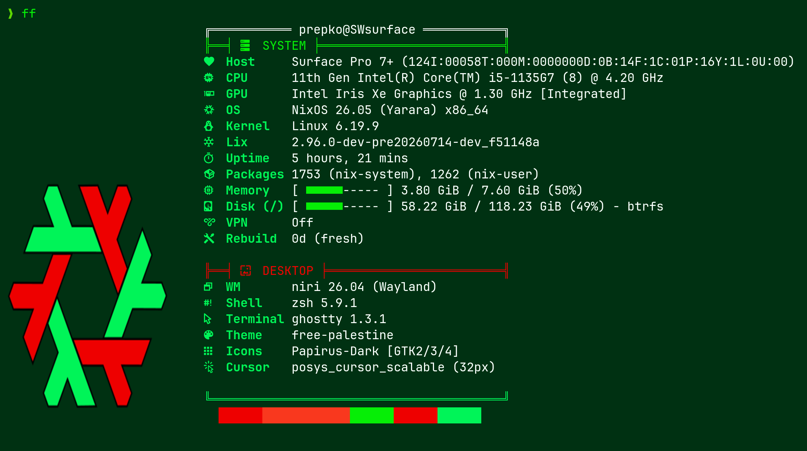
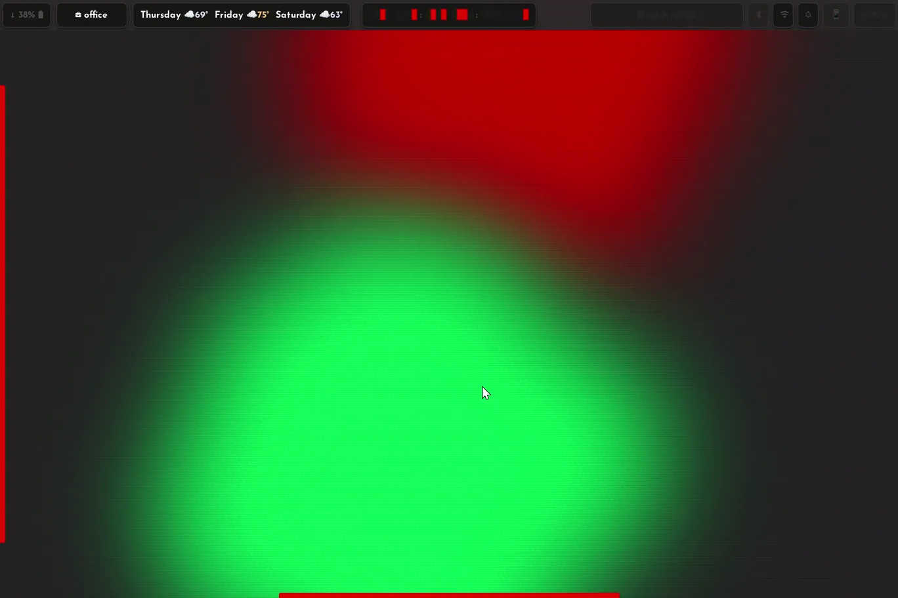

# nixos-dots

My NixOS config for two machines: a desktop and a Surface Pro 7+. It's the successor to [dotfiles](https://github.com/SW-philip/dotfiles), which I've stopped updating (Its a distinctly different aesthetic, but is starred. Feel free to fork it I guess?).



This is tuned to my hardware and my habits. Read it, borrow from it, but know that I will break things in it regularly and fix them immediately, or a day or two later. This was all started as a learning experience, and will continue as such. But I think I'm ready to share more of it.

|---|---|
|  |

## Machines

| host | what | nixpkgs |
|---|---|---|
| `desktop` | i5-9600K, GTX 1660, two FHD monitors with DP (and sometimes a TV via HDMI) | unstable |
| `surface` | Surface Pro 7+, linux-surface kernel, 8 GB of RAM | nixos-26.05 |

| desktop | surface |
|---|---|
|  |  

They're on different channels on purpose, so a shared module can't assume either one's option shapes. The Surface offloads its builds to the desktop to avoid...well...an explosion.

Both use [Lix](https://lix.systems), secure boot through lanzaboote, LUKS, btrfs subvolumes and impermanence. Secrets are sops-nix with age.

## What's in it

- **[niri](https://github.com/YaLTeR/niri)** as the compositor, with Waybar, swaync, fuzzel and ghostty around it. hyprlock is still the lock screen, and the login greeter is a small GTK app in `pkgs/greeter`.
- **Theming.** Every colour comes from a palette file. `scripts/auto-theme.py` generates a palette from a few seed colours and `drmis` switches the whole desktop to one live. 19 palettes are in `themes/`. Most wallpapers aren't in the repo.
- **[sqlch](https://github.com/SW-philip/sqlch)**, an internet radio player I wrote, is its own flake input.
- **Emulation.** Pegasus plus RetroArch cores and standalone emulators, set up in `home/emulation`. The Surface gets a lighter set.
- **A locked-down account for a kid**, with its own touch-friendly dashboard.
- Plenty of small scripts for Bluetooth battery levels, notifications, backups and recovery. Those are in `scripts/` and `home/*.nix`.

## Recordings



One of the things that I spent way too much time on was a physical-state toggled tablet mode. Detaching the keyboard toggles a larger ledger bar as well as "pulltabs" on the wing and ledger menus. Squeekboard toggles on, but only by tapping 3 fingers on the screen, or by tapping into a text field. A 4-fingered tap opens a dialog box in pegasus verifying the desire to close it.

A snark-engine peppers insults, passive aggression, burns, and digs into waybar modules, dialog boxes, invalid password attempts, and more. Sometimes they're funny. Sometimes they're direct. but they're always practical. It's awesome.


## Layout

```
hosts/<name>/       one machine: hardware, boot, its own services
roles/              system config shared by more than one host
modules/            one-service opt-in modules
identities/         user account declarations
profiles/           per-person, per-host home-manager entrypoints
home/               reusable home-manager modules
pkgs/               things I packaged or wrote
themes/             palettes and per-app theme files
scripts/            helpful scripts (one-off and otherwise)
```

## If you want to borrow it

- `secrets/*.yaml` are placeholders with my key names and no real values. Make your own age keys, put them in `.sops.yaml` and re-encrypt, or anything that reads a secret will fail.
- Search for `AAAA-REPLACE-WITH-YOUR-PUBLIC-KEY`, `example.ts.net` and the `00:00:00:00:00:0x` Bluetooth addresses. Those were scrubbed from my real values.
- `hosts/*/hardware.nix` is for my disks. Generate yours.
- The username `prepko` is hardcoded in places.

Build one host with `nh os switch --hostname desktop .` or `--hostname surface`. Flakes only see tracked files, so `git add` new ones first.

## About the history

This repo gets one commit per release, tagged by date (`2026.09.30`). The day-to-day work lives in a private repo, so `git blame` here won't tell you much.

## License

MIT.
